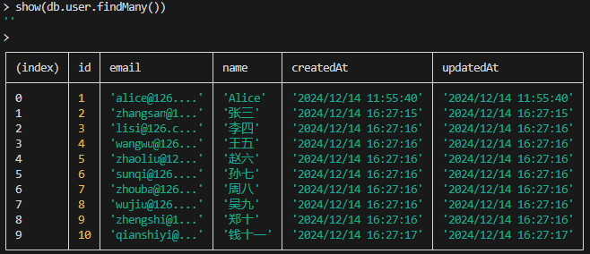

# prisma-shell

Prisma interactive command-line shell.

## Installation

Install and configure `prisma` first, then execute the following command to install.    

```bash
npm install prisma-shell
pnpm i prisma-shell
yarn add prisma-shell
```

## Usage

### Start

```bash
> prisma-shell
```


### Show modles

use `.models` to show all models.

```bash
> .models
User,Post           # output
```

### Access PrismaClient

Use `prisma` or `db` to access `PrismaClient` instance.

```bash
> prisma   
> await db.user.findMany()      
> await db.post.findMany()
> await db.user.count()
>  # ....
```

### List table data

use `.list` to show table data.

```bash
> .list user
```


- **Show n page**

```bash
# show user 2 of page, 10 rows per page
> .list user 2  
```
- **Specify fields**

```bash
# Show user table data, only show id and email fields
> .list user 2 id,email 
# =>
> .list user id,email  2
```


- **show**

Use `show` function to display data.

```bash
> show(db.user.findMany())
```

`show` function display data by `console.table`.



